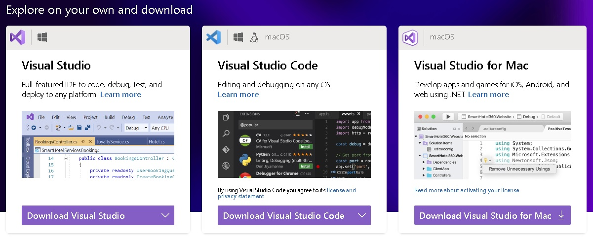
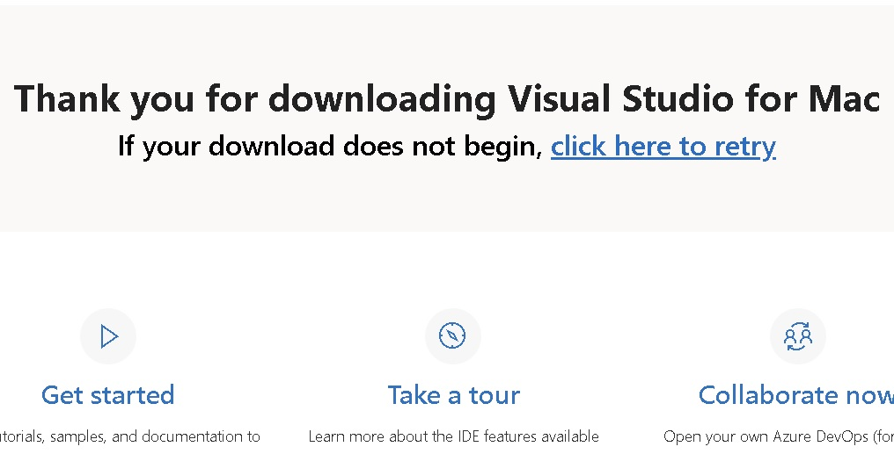
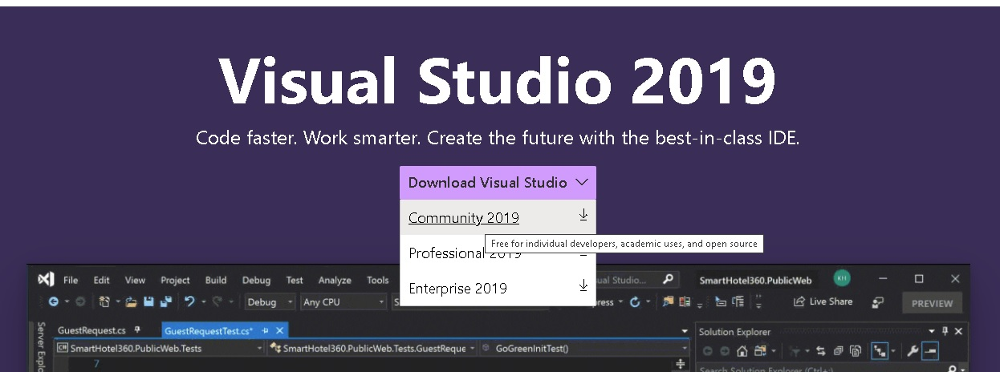
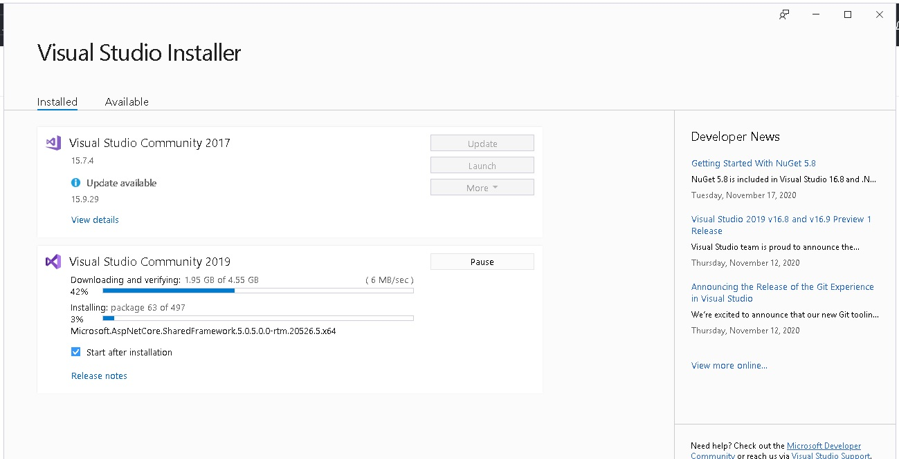
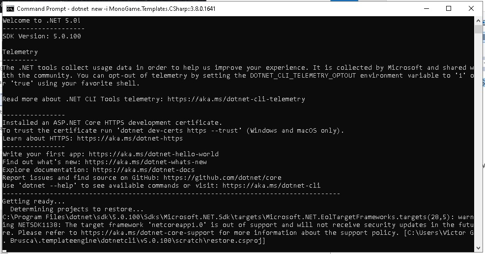
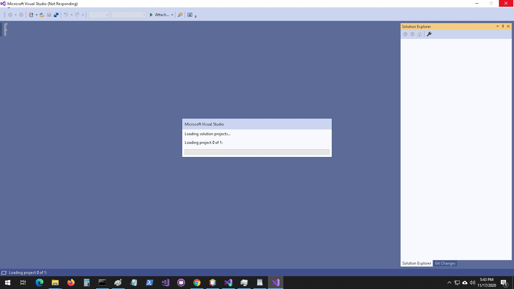
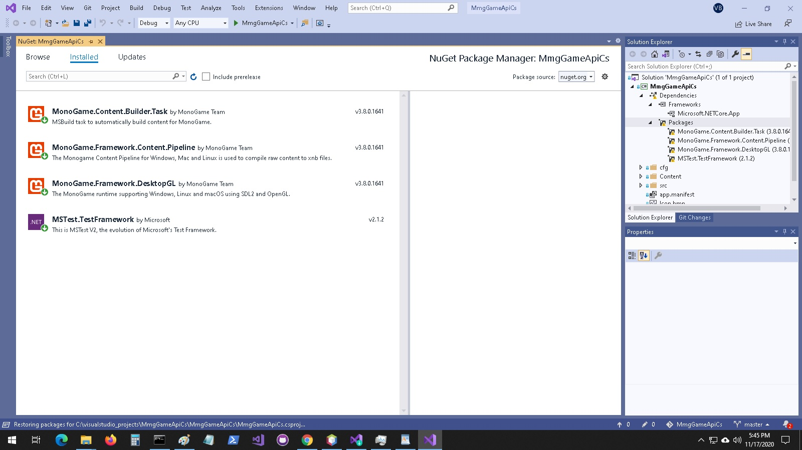
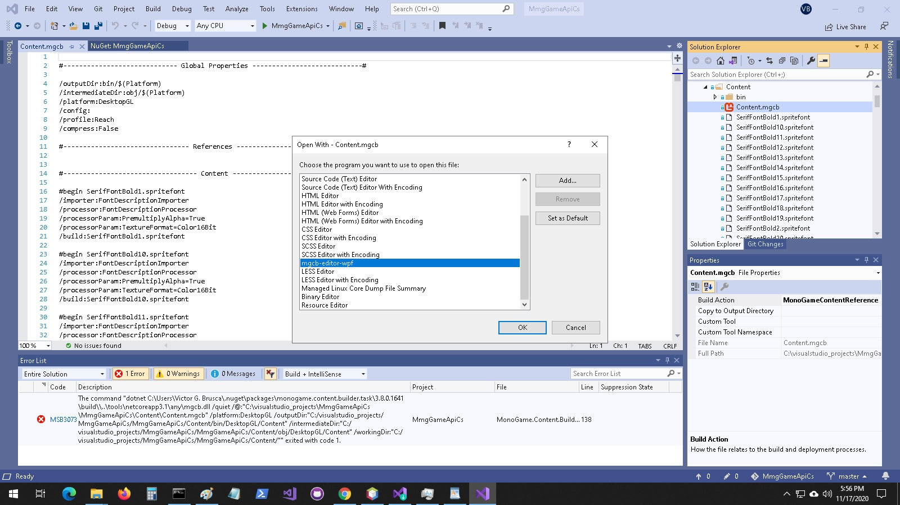
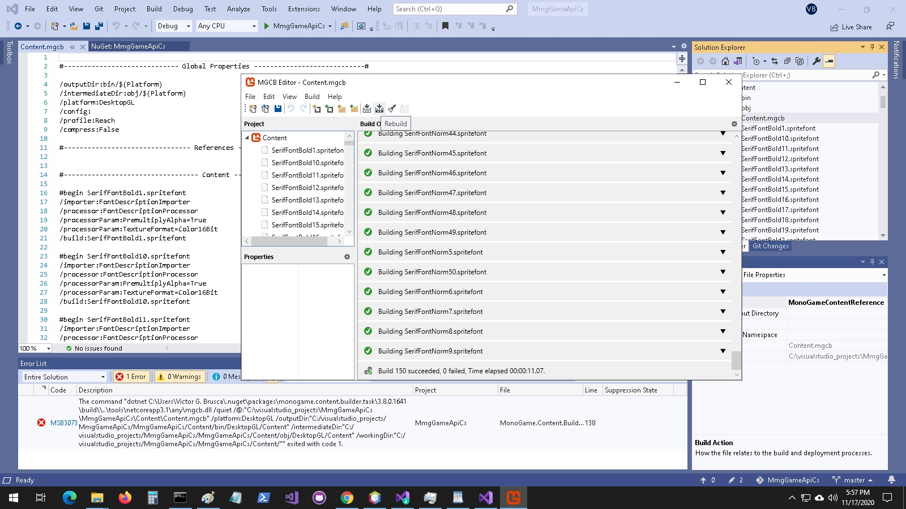
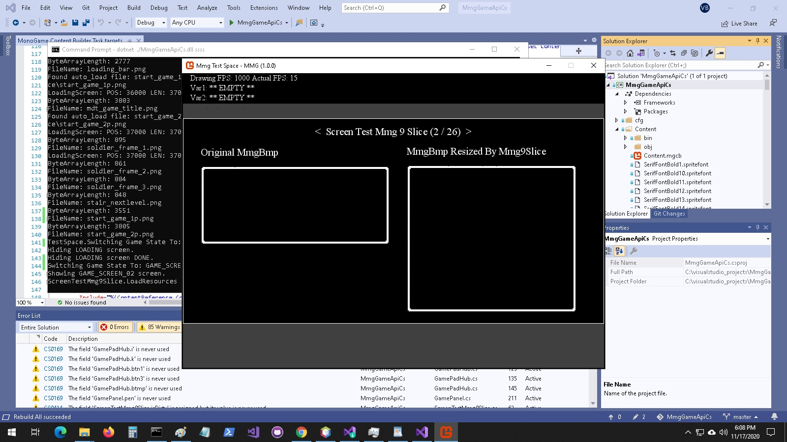

# MmgGameApiCs
A 2D game API written in C# using the MonoGame XNA engine. Build an entire game right in your IDE in C# with MonoGame. Almost fully compatible at the code level, library code, with the Java version of the game API.

## Detailed Explantion of the API
A detailed explanation of the API can be found in this book, although it follows the Java version of the game engine more closely the core API code is almost identicle so you could potentially follow along or gain a lot of knowledge applicable to the C# version of the project.
 
 
[*Introduction to Video Game Engine Development*](https://github.com/Apress/introduction-video-game-engine-development)

## Games that Use The API
You can find the mot advanced game that uses the API here:
 
 
[Tyre](https://github.com/vbrusca/MmgGameApi-TyreSK)
 
 
This is a port of a T-Mobile SideKick game to the API. It is very easy to convert old T-Mobile SideKick games to this API and this project serves as an example.
There are also compatible games in this book repo:
 
 
[*Introduction to Java Through Game Development*](https://github.com/Apress/introduction-to-java-through-gamedev)

## Packages / Namespaces
<b>net.middlemind.MmgGameApiCs.MmgBase</b>
 
 
This is the lowest level API in the game engine SDK. It sits on top of the underlying framework technology. For the Java project it plugs into the Java Swing and AWT APIs. For the C# project it plugs into Monogame APIs which use OpenGL and OpenAL.
 
 
<b>net.middlemind.MmgGameApiCs.MmgCore</b>
 
 
This is the mid-level API in the game engine SDK. It sits between the low-level API, MmgBase, and the actual game implementation. It handles tasks like setting up the application window and drawing surfaces, loading resources, processing input. It also handles XML driven configuration, events, and more robust game screens.
 
 
<b>net.middlemindMmgGameApiCs.MmgTestSpace</b>
 
 
This package represents the application level and really isn’t an SDK API. It is an example of an implementation of the SDK with runtime code included. This application, when executed, demonstrates how to use classes from the MmgBase and MmgCore APIs.

## Class Listing
<ul>
  <li>
    <b>Base Classes:</b>
     
    <ul>
      <li>MmgObj</li>
      <li>MmgColor</li>
      <li>MmgRect</li>
      <li>MmgFont</li>
      <li>MmgSound</li>
      <li>MmgPen</li>
      <li>MmgVector2</li>
      <li>MmgBmp</li>
    </ul>
  </li>
  <li>
    <b>Helper Classes:</b>
     
    <ul>
      <li>MmgApiUtils</li>
      <li>MmgHelper</li>
      <li>MmgScreenData</li>
      <li>MmgFontData</li>
      <li>MmgDebug</li>
      <li>MmgBmpScaler</li>
      <li>MmgMediaTracker</li>
    </ul>  
  </li>
  <li>
    <b>Advanced Classes:</b>
    <ul>
      <li>Mmg9Slice</li>
      <li>MmgContainer</li>
      <li>MmgLabelValuePair</li>
      <li>MmgLoadingBar</li>
      <li>MmgLoadingBar</li>
      <li>MmgSprite</li>
      <li>MmgDrawableBmpSet</li>
    </ul>
  </li>

  <li>
    <b>Widget Classes:</b>
    <ul>
      <li>MmgTextField</li>
      <li>MmgTextBlock</li>
      <li>MmgScrollVert</li>
      <li>MmgScrollHor</li>
      <li>MmgScrollHorVert</li>
      <li>MmgMenuContainer</li>
      <li>MmgMenuItem</li>
    </ul>
  </li>
  <li>
    <b>Screen Classes:</b>
    <ul>
      <li>MmgSplashScreen</li>
      <li>MmgLoadingScreen</li>
      <li>MmgGameScreen</li>
    </ul>
  </li>
  <li>
    <b>Animation Classes:</b>
    <ul>
      <li>MmgPulse</li>
      <li>MmgPosTween</li>
      <li>MmgSizeTween</li>
    </ul>
  </li>
  <li>
    <b>Other Classes:</b>
    <ul>
      <li>MmgCfgFileEntry</li>
      <li>MmgEvent</li>
      <li>MmgEventHandler</li>
      <li></li>      
    </ul>
  </li>
</ul>

## Setting Up Your Environment
The code that powers this engine in two flavors Java and C#. That being said, this part only follows the Java code. All the method breakdowns are done while reviewing Java code. However, there is a complete C# implementation of the game engine and the MmgBase API is very similar between both engine versions. The next sections will show you how to setup your environment for viewing the associated projects in Visual Studio, for the C# project.

## Installing the Visual Studio IDE
For this section you’ll need internet access to download a copy of the IDE and the C# version of the project that is associated with this book. Because the C# version of the game engine requires the Visual Studio IDE some Linux users may not have access to Visual Studio. Please follow along by viewing the source code using your favorite text editor. For Mac and Windows users, once you’re online and settled navigate your favorite browser to the Visual Studio IDE main site, https://visualstudio.microsoft.com/. You should see something similar to the screen shot depicted below.

Click the download links for Mac and Windows and you’ll see the following screens respectively.

Find the resulting download and start the install process. Below is a screen shot showing the Window installation.

Once Visual Studio is done installing open up a command prompt, cmd.exe in the windows search bar. Run the following commands in the command prompt shown in the screen shot shown below.

<pre>
dotnet new -i MonoGame.Templates.CSharp::3.8.0.1641
dotnet tool install -g dotnet-mgcb
dotnet tool install -g dotnet-mgcb-editor
mgcb-editor –register
</pre>

Open the game engine project for visual studio and you should be greeted by the following screen.

Double check that the NuGet packages have all been installed.

Expand the Content folder and select the Content.mgcb file. Right-click on it and select Open With from the menu options. Select the MGCB editor as shown below and open the content file.

When the content editor window opens click the Rebuild icon on the top right-hand side of the editor icon bar. Wait for the editor to finish compiling the content.

Rebuild the MmgGameApiCs project. If you encounter the following error. I’ve listed the error code and a part of the error text since the stacktrace will most likely be different for your environment.

<pre>
Error    MSB3073   any\mgcb.dll /quiet  exited with code 1.
</pre>

Double click the error message and comment out the command executed after the following comment, “Execute MGCB from the project directory so we use the correct manifest.”. We can just run the compile step on our own when the content changes which should not be often.
You should now be able to clean and build the project. If you navigate to the project directory and find the bin folder you can run the following command to execute the example application.

<pre>
C:\visualstudio_projects\MmgGameApiCs\MmgGameApiCs\bin\Debug\netcoreapp3.1>dotnet ./MmgGameApiCs.dll example 
</pre>

You’ll have to adjust the path you use to match your environment. You should see the following application launch after a few seconds.

That brings us to the conclusion of this section.

